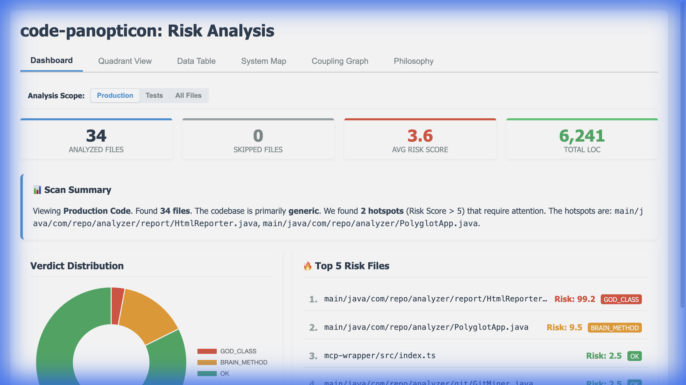
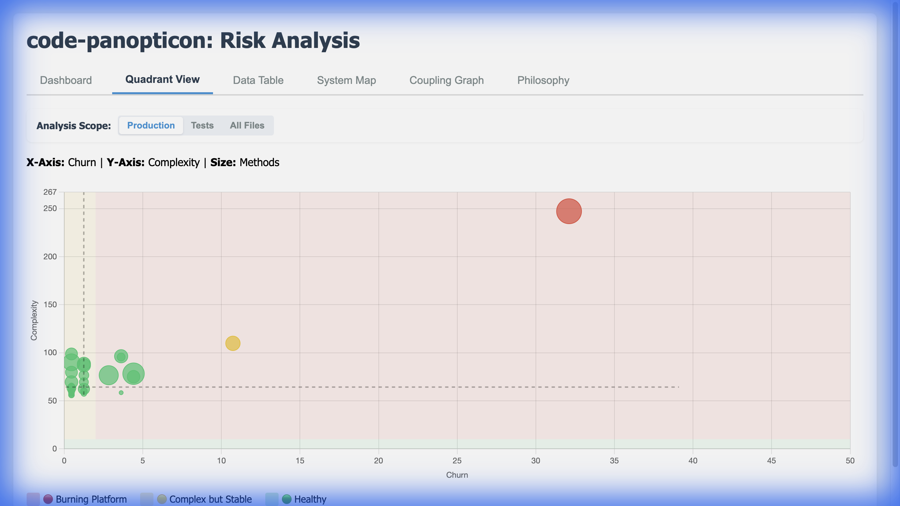
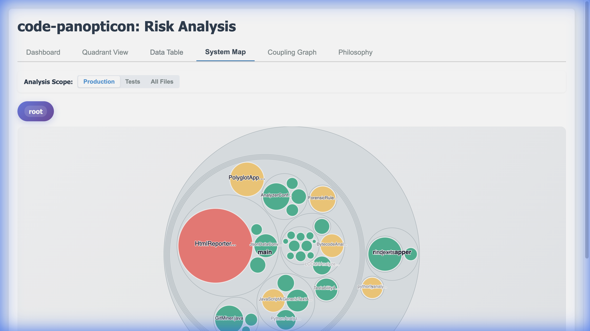
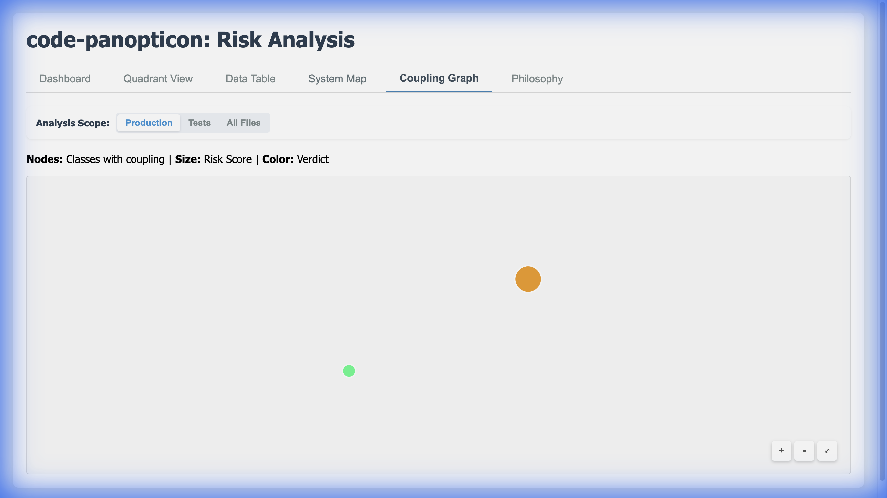
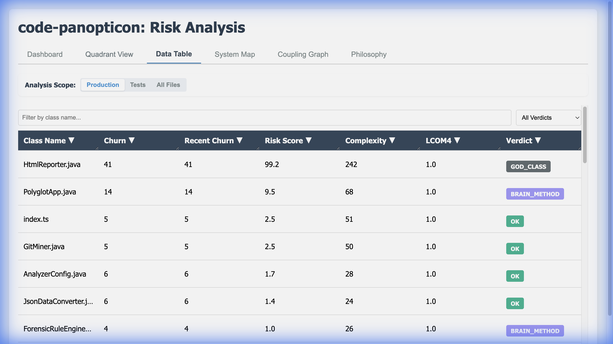
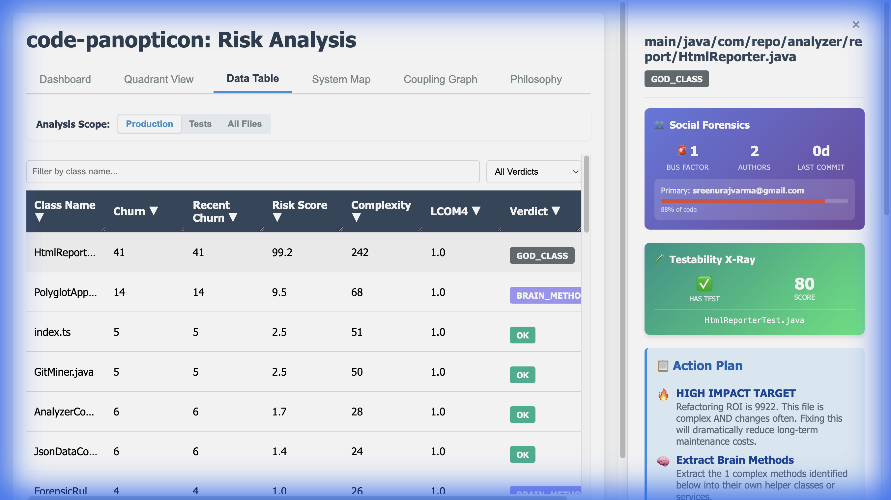

# Code Panopticon

> *"From Passive Visualizer to Active Architectural Advisor"*

A **polyglot code forensic intelligence platform** that identifies architectural decay by fusing **Evolutionary History (Git)**, **Structural Analysis**, **Social Dynamics**, and **Testability Assessment**.

Supports: **Java** (bytecode), **Python** (AST), **JavaScript/TypeScript** (regex), and any other language (generic fallback).



---

## 📸 Gallery

| **Quadrant View** (Churn vs Complexity) | **System Map** (Codebase Topology) |
|:---------------------------------------:|:----------------------------------:|
|  |  |

| **Coupling Graph** (Dependencies) | **Data Table** (Deep Metrics) |
|:---------------------------------:|:-----------------------------:|
|  |  |

| **Side Panel** (Forensics & Action Plan) |
|:----------------------------------------:|
|  |

---

## 🚀 Purpose

In large-scale projects, standard linters fail to capture the **Context of Risk**. Code Panopticon analyzes code through four integrated lenses:

| Dimension | Question | Metrics |
|-----------|----------|---------|
| **📐 Structure** | How complex is this code? | Complexity, Cohesion, Coupling |
| **⏱️ Evolution** | How often does it change? | Churn, Temporal Coupling |
| **👥 Social** | Who knows this code? | Bus Factor, Knowledge Islands |
| **🛡️ Safety** | Is it safe to change? | **Test Coverage**, **Test Smells**, **Assertions** |

The goal: Identify **"Burning Platforms"**—highly active files that are structurally unsound, maintained by absent experts, or lacking a safety net—so teams can prioritize refactoring where it matters most.

---

## 📊 The Metrics

### Evolutionary Metrics

| Metric | Description |
|--------|-------------|
| **Churn** | Number of Git commits touching the file |
| **Recent Churn** | Commits in the last 90 days |
| **Temporal Coupling** | Files that change together (hidden dependencies) |

### Structural Metrics

| Metric | Description |
|--------|-------------|
| **Complexity (CC)** | Cyclomatic complexity—measures branching |
| **Max CC** | Complexity of the worst function |
| **Cohesion (LCOM4)** | How related methods are to each other |
| **Fan-Out** | Number of dependencies (imports) |

### Social Metrics

| Metric | Description |
|--------|-------------|
| **Bus Factor** | Authors needed to cover 50% of code |
| **Primary Author %** | Knowledge concentration |

### Test & Safety Metrics

| Metric | Description |
|--------|-------------|
| **Testability Score** | How easy the code is to test (based on seams/coupling) |
| **Assertion Count** | Number of assertions in test files |
| **Framework** | Auto-detected test framework (JUnit, Playwright, etc.) |
| **Hardcoded Waits** | Usage of `Thread.sleep` or `cy.wait` (flakiness risk) |

---

## 📋 Verdict Definitions

The system assigns a single **Primary Verdict** to each file based on a priority engine.

### Critical Verdicts (Immediate Attention)

| Verdict | Meaning | Action |
|---------|---------|--------|
| **KNOWLEDGE_ISLAND** | Single author + inactive expert | **Knowledge transfer first** |
| **SHOTGUN_SURGERY** | Changes ripple to many files | Centralize logic |
| **UNTESTED_HOTSPOT** | High risk + No test coverage | **Write tests before refactoring** |
| **TOTAL_MESS** | High Complexity + High Churn | **Refactor priority** |

### Code Quality Verdicts

| Verdict | Meaning | Action |
|---------|---------|--------|
| **GOD_CLASS** | Too complex and too large | Full decomposition |
| **BRAIN_METHOD** | Contains massive, complex methods | Extract Method |
| **SPLIT_CANDIDATE** | Multiple unrelated clusters | Split the class |
| **HIGH_COUPLING** | Too many dependencies | Dependency Inversion |
| **BLOATED** | Large file with many LOC | Consider splitting |

### Test Health Verdicts

| Verdict | Meaning | Action |
|---------|---------|--------|
| **ASSERTION_ROULETTE** | Too many assertions in one test | Split into focused tests |
| **EAGER_TEST** | Test checks too many behaviors | One behavior per test |
| **MYSTERY_GUEST** | Relies on external resources | Inline test data |

---

## 🏃 How to Run

### Prerequisites
- Java 17+
- Python 3 (for Python analysis)
- Node.js (optional, for ESLint-based JS analysis)

### Quick Start

```bash
# Clone and build
git clone https://github.com/praveens9/code-panopticon.git
cd code-panopticon
./gradlew compileJava

# Run analysis on current directory
./gradlew run --args="--repo ." --console=plain
```

### CLI Options

| Option | Description |
|--------|-------------|
| `--repo <path\|url>` | Path to local Git repository **or** GitHub URL |
| `--output <dir>` | Output directory for reports (default: `reports/`) |
| `--name <name>` | Custom project name for report title |
| `--test-only` | Treat **all files** as test code (e.g., for automation repos) |
| `--framework <name>` | Manually specify test framework (e.g. `playwright`) |
| `--hotspots-only` | Only analyze files with Git activity |

---

## 🤖 AI Agent Integration (MCP)

Code Panopticon serves as a "Smart Tool" for AI agents (like Claude Desktop) via the **Model Context Protocol (MCP)**. This allows your AI to:

1.  **Analyze** the codebase on demand.
2.  **Identify** high-risk "Burning Platforms".
3.  **Inspect** specific files for detailed metrics and test health.
4.  **Recommend** refactoring strategies based on the philosophy.

For full installation and tool documentation, see the [MCP Wrapper README](mcp-wrapper/README.md).

---

## 📚 Documentation

- [Philosophy](philosophy.md) - Core beliefs and design rationale
- [Architecture Plan](docs/plan.md) - Detailed design decisions

---

## 📄 License

This project is licensed under the MIT License - see the [LICENSE](LICENSE) file for details.
