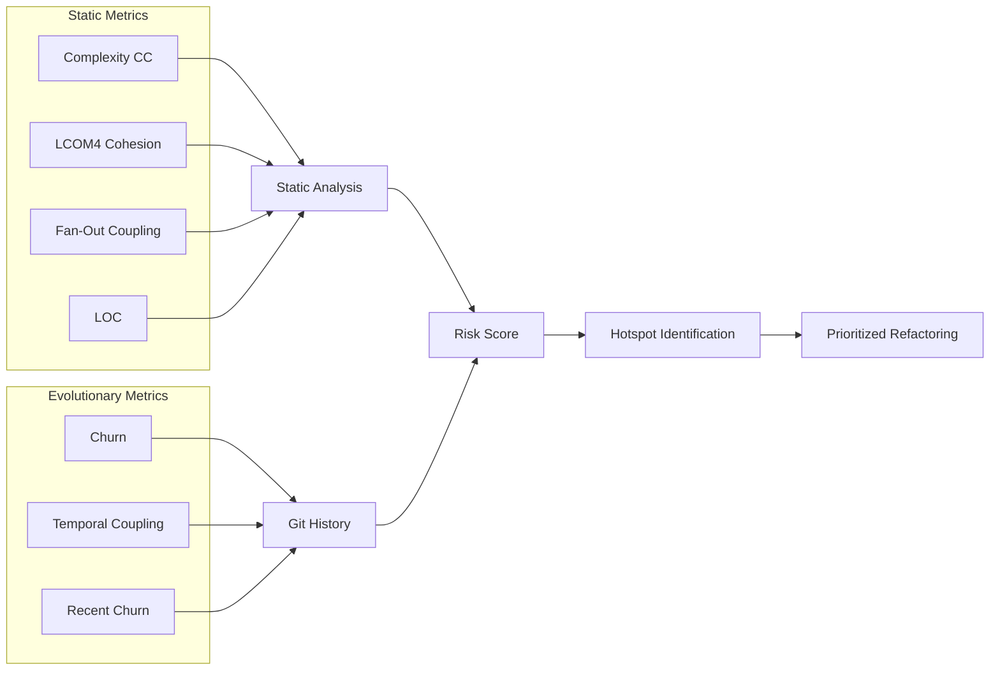

# Code Panopticon: Deep Research & Product Direction

This document presents a comprehensive analysis of the Code Panopticon philosophy, exploring new paradigms, missing metrics, network visualization improvements, and product positioning.

---

## 1. Executive Summary

Code Panopticon brilliantly combines **static code analysis** with **evolutionary git history** to identify "hotspots"—areas where high maintenance effort meets poor code quality. This analysis reveals opportunities to extend this paradigm and address current gaps.

> [!IMPORTANT]
> **Key Finding**: The core philosophy is sound and aligns with industry research (Adam Tornhill's "Your Code as a Crime Scene"). The main opportunities lie in expanding the paradigm and improving actionability.

---

## 2. The Current Philosophy Summarized



**Core Insight**: *Complexity is only a problem if we have to work with it.* A complex file unchanged for 5 years is stable; a complex file modified weekly is a risk.

---

## 3. New Paradigms to Extend the Philosophy

### 3.1 Knowledge Distribution / Bus Factor Analysis

**What Is It?**
The "bus factor" measures how many key developers could leave before a project stalls. This analyzes **who knows what** in the codebase using `git blame` patterns.

**Why Add It?**
- Identifies "knowledge islands" where only one developer understands critical code
- Hotspots become even more critical if only one person can fix them
- Enables proactive knowledge sharing recommendations

**Implementation Approach**:
1. Parse `git blame` for each file
2. Calculate author contribution percentages
3. Flag files where >80% of code is by one author who hasn't committed in 90+ days

**New Verdict**: `KNOWLEDGE_ISLAND` - "Single developer dependency detected"

---

### 3.2 Test Coverage Correlation

**What Is It?**
Correlate code metrics with test coverage data to identify **risky untested hotspots**.

**Why Add It?**
- High-churn, high-complexity files with low test coverage = extreme risk
- Research shows test-to-code ratio of 1:1 or higher correlates with lower defect density
- Enables "test before refactor" recommendations

**Formula**: `Testing Risk = (Churn × Complexity) / (1 + TestCoverage%)`

**New Verdict**: `UNTESTED_HOTSPOT` - "High-risk code with insufficient test coverage"

---

### 3.3 Architecture Stability Index

**What Is It?**
Martin's Stable Dependencies Principle: high-level policy modules should be stable (hard to change), while low-level details should be unstable (easy to change).

**Current State**: Already tracking Fan-Out and Afferent Coupling
**Enhancement**: Calculate the **Instability metric** at the package/folder level, not just file level.

**Formula**: `Instability = Efferent / (Afferent + Efferent)`

**New Insight**: Detect "stable modules depending on unstable modules" = architectural violation.

---

### 3.4 Commit Message Sentiment Analysis

**What Is It?**
Analyze commit messages for patterns indicating technical debt or frustration:
- "quick fix", "hack", "TODO", "workaround", "revert"
- Repeated "fix bug in X" commits

**Why Add It?**
- Self-admitted technical debt (SATD) in comments/commits correlates with actual debt
- Developers often document their pain in commit messages
- Can surface "code that developers hate touching"

---

### 3.5 Code Age Analysis

**What Is It?**
Track the age distribution of code:
- **Legacy code**: Unchanged for >2 years (stable but risky if needs change)
- **Active code**: Changed in last 6 months
- **Abandoned code**: Created but never revisited

**Why Add It?**
- Old code touched for first time in years = high regression risk
- Helps distinguish "stable" from "abandoned"

---

## 4. Missing Metrics Analysis

### Currently Tracked ✓

| Metric | Purpose |
|--------|---------|
| Churn | Activity level |
| Recent Churn | Current focus |
| Cyclomatic Complexity | Branching difficulty |
| LCOM4 | Cohesion/responsibility |
| Fan-Out | Dependencies |
| Afferent Coupling | Dependents |
| Instability | Change sensitivity |
| LOC | Size |
| Temporal Coupling | Hidden dependencies |

### Proposed New Metrics

| Metric | Purpose | Priority |
|--------|---------|----------|
| **Author Count** | How many developers have modified this file | High |
| **Primary Author %** | Concentration of knowledge | High |
| **Days Since Last Commit** | Code freshness/staleness | Medium |
| **Test-Code Ratio** | Testing investment | Medium |
| **Defect Correlation** | Bug-proneness (if integrated with issue tracker) | Low |
| **Comment Density** | Documentation level | Low |
| **Method Count** | Already tracked but underutilized | Medium |
| **Avg Method Size** | Granularity of functions | Medium |
| **Duplicate Code %** | Copy-paste debt | Medium |

---

## 5. Network Visualization: Making It Useful

### Current State
The network tab shows temporal coupling relationships but lacks clear purpose for users.

### Problems Users Face:
1. **"What am I looking at?"** - No clear story or call-to-action
2. **"Why should I care?"** - No business impact visible
3. **"What do I do now?"** - No actionable recommendations

### Proposed Improvements

#### 5.1 Network Use Cases (Add Explanation)

```
┌─────────────────────────────────────────────────────────────┐
│  🔗 Network View: Temporal Coupling Analysis                │
├─────────────────────────────────────────────────────────────┤
│                                                             │
│  This visualization shows files that CHANGE TOGETHER.       │
│                                                             │
│  💡 What to look for:                                       │
│  • Clusters = Features that span multiple files             │
│  • Thick lines = Strong coupling (>5 co-commits)            │
│  • Big red nodes = High-risk files                          │
│                                                             │
│  🎯 Why it matters:                                         │
│  • If A and B always change together but aren't connected   │
│    in code, you have a HIDDEN DEPENDENCY                    │
│  • Changing A without B causes bugs                         │
│                                                             │
└─────────────────────────────────────────────────────────────┘
```

#### 5.2 Add Network Metrics to Side Panel

When clicking a node:
- **Coupled Files**: List actual files this changes with
- **Coupling Strength**: Number of co-commits
- **Suggested Action**: "This file has hidden dependencies with X, Y, Z. Consider making the relationship explicit via imports or extracting shared logic."

#### 5.3 Add "Clusters" View

Group files into cohesive clusters based on coupling, then label them:
- "User Authentication Feature" (if paths suggest it)
- "Database Layer"
- Detect cross-cutting concerns

#### 5.4 Filter Options

- Filter by coupling strength (>3, >5, >10 co-commits)
- Filter to show only connections to selected file
- Filter by verdict (show only risky nodes)

---

## 6. The Sidebar Bug Analysis

### Issue Description


The file `frontend/src/components/ui/sidebar.tsx` shows:
- **Table verdict**: `BLOATED`
- **Side panel says**: "🎉 Healthy Code - No major issues"

### Root Cause

In [HtmlReporter.java](file:///Users/sreenuraj/code-panopticon/app/src/main/java/com/repo/analyzer/report/HtmlReporter.java#L886-L893), the `diagnose()` function **does not handle the BLOATED verdict**:

```javascript
function diagnose(d) {
    if (d.verdict === 'BRAIN_METHOD') return { ... };
    if (d.verdict === 'SHOTGUN_SURGERY') return { ... };
    if (d.verdict === 'TOTAL_MESS') return { ... };
    // ... other verdicts
    if (d.verdict === 'GOD_CLASS') return { ... };
    return { title: "Healthy Code", desc: "No major issues", ... };  // ← Falls through here!
}
```

**The fix**: Add a case for `BLOATED`:

```javascript
if (d.verdict === 'BLOATED') return { 
    title: "Bloated File", 
    desc: "Large file with many lines of code", 
    why: `LOC = ${d.loc}`, 
    fix: "Consider splitting into smaller, focused modules" 
};
```

---

## 7. Side Panel Improvements

### Current Content
- Verdict badge
- 10 metrics (Risk Score, Churn, etc.)
- Forensic reports (conditional)
- Action plan

### Proposed Additions

#### 7.1 File History Timeline

```
📅 Activity Timeline
├─ Last 30 days:  ██████████ 12 commits
├─ Last 90 days:  ████░░░░░░ 18 commits  
└─ Last year:     ██████████ 45 commits

Top Contributors:
  @alice (65%)  @bob (25%)  @charlie (10%)
```

#### 7.2 Peer Files Section

```
🔗 Often Changes With:
  • ConfigService.java (8 times)
  • SecurityFilter.java (5 times)
  • application.yml (4 times)
```

#### 7.3 Trend Indicators

```
📈 Trends
  Complexity: ↗️ +15% (last 30 days)
  Churn: ↘️ -20% (stabilizing)
  Risk Score: → Stable
```

#### 7.4 Link to Code

Add a button: **"Open in IDE"** or **"View in GitHub"**

#### 7.5 Refactoring Checklist

For high-risk files, provide a concrete checklist:
```
☐ Add unit tests (current coverage: 0%)
☐ Extract method: processLargeRequest() 
☐ Split class: Consider separating authentication logic
☐ Add documentation
```

---

## 8. Product Positioning: What Is This Tool For?

### The Problem It Solves

> [!NOTE]
> **Core Value Proposition**: Code Panopticon helps development teams **prioritize technical debt** by showing where to invest refactoring effort for maximum ROI.

### User Personas

| Persona | Need | How Panopticon Helps |
|---------|------|----------------------|
| **Tech Lead** | "Where should my team focus refactoring?" | Risk-ranked file list |
| **New Developer** | "What are the danger zones I shouldn't touch carelessly?" | Visual hotspot map |
| **Engineering Manager** | "How healthy is our codebase over time?" | Trend reports |
| **Architect** | "Is our architecture decaying?" | Coupling network, package-level metrics |

### Key Workflows to Support

1. **Sprint Planning**: "Pick one hotspot to improve this sprint"
2. **Code Review**: "Is this change in a risky area?"
3. **Onboarding**: "Understand the codebase structure quickly"
4. **Tech Debt Budgeting**: "Quantify debt for leadership"

### Missing Features for Product-Market Fit

| Feature | Impact |
|---------|--------|
| **Trend over time** | Show improvement/degradation |
| **Team integration** | GitHub Actions, CI/CD reports |
| **IDE plugin** | Real-time warnings in editor |
| **Comparison view** | "Before vs After" refactoring |
| **Export for stakeholders** | PDF/presentation-ready reports |

---

## 9. Summary of Recommendations

### Immediate Fixes (Bug)

1. **Fix BLOATED verdict in diagnose()** - Add missing case in `HtmlReporter.java`

### High Priority Enhancements

2. **Add Author/Knowledge metrics** - Bus factor visibility
3. **Improve Network UX** - Add explanation, filter controls, cluster labels
4. **Enhance Side Panel** - Add peer files, history timeline, trends

### Medium Priority (New Paradigms)

5. **Test Coverage Integration** - Flag untested hotspots
6. **Code Age Analysis** - Distinguish stable vs abandoned
7. **Commit Sentiment Analysis** - Detect self-admitted debt

### Product Direction

8. **Add trend tracking** - Historical comparison
9. **CI/CD integration** - Quality gates
10. **Focus user experience** - Clear workflows for each persona

---

## 10. References

- Adam Tornhill, *Your Code as a Crime Scene* (2015)
- Adam Tornhill, *Software Design X-Rays* (2018)
- CodeScene Documentation: [codescene.io](https://codescene.io)
- IEEE Research on Code Churn and Defects
- Martin Fowler on technical debt refactoring
